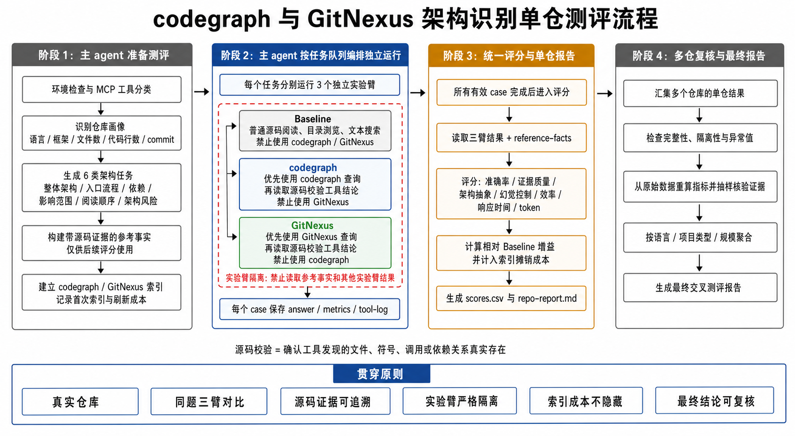

# 面向内网 AI Agent 的代码架构识别工具实证评测：codegraph 与 GitNexus 的多仓对比研究

## 摘要

随着大语言模型逐步进入软件研发流程，AI Agent 对陌生代码仓库的理解能力成为影响代码生成、缺陷修复、影响分析和新人 onboarding 质量的重要因素。普通 Agent 可以通过文件读取和文本搜索探索代码，但在大型仓库中容易产生高探索成本、上下文浪费和架构关系遗漏。代码图谱与代码库理解工具试图通过预先索引符号、依赖和调用关系，为 Agent 提供更稳定的架构上下文。

本文设计并实施了一套面向真实内网研发场景的代码架构识别评测方法，对 `codegraph` 与 `GitNexus` 相对普通源码阅读 Baseline 的实际收益进行比较。实验使用 5 个真实代码仓库，其中包含 2 个 Java 项目和 3 个 Vue 项目。每个仓库围绕整体架构、入口流程、依赖关系、影响范围、新人阅读顺序和架构风险等 6 类任务，分别运行 Baseline、codegraph 和 GitNexus 三个独立实验臂，并从准确率、证据质量、架构抽象、幻觉控制、响应时间、文件读取、搜索次数、工具调用、token 或代理 token、索引与刷新成本等维度进行评价。

交叉测评表明，代码架构识别工具的价值具有明显的语言与框架依赖性。Java 项目的静态分层、类方法符号和调用关系更适合通用代码图谱工具发挥；Vue 项目的关键架构关系则分散在单文件组件模板、编译宏、路由配置、状态管理、动态 import 和构建插件中，导致通用代码图谱与检索工具难以恢复完整的运行结构。就工具特征而言，codegraph 更接近轻量、结构化、可刷新且易于验证的代码地图；GitNexus 更接近面向 Agent 的综合代码理解工作台，能够提供更厚的上下文和工作流能力，但 analyze 成本与使用复杂度更高。

本文认为，代码架构识别工具不应仅以“能否回答问题”评价，而应以相对 Baseline 的质量增益、探索成本节约、索引维护成本和结果可复核性综合判断。对于内网 AI 开发助手建设，codegraph 更适合作为可评测的结构事实底座；GitNexus 可作为上下文组织和工作流增强层；对于 Vue 等前端项目，还需要引入框架专用解析能力，才能从目录级理解提升到运行结构级理解。

> 注：当前仓库中尚未包含最终交叉测评报告、聚合 CSV 和结果图。本文保留定量结果表位，不填入未经验证的数字。获得最终报告后，应替换第 5 节中的待补数据，并增加对应结果图。

**关键词：** AI Agent；代码架构识别；代码图谱；codegraph；GitNexus；静态分析；Vue；Java

## 1. 引言

大语言模型能够生成代码、解释函数和回答局部问题，但对陌生代码仓库的理解仍然面临明显挑战。一个真实项目通常包含大量源码文件、构建配置、框架约定、历史演化结构和间接依赖。Agent 如果仅依靠普通文件读取与文本搜索，往往需要反复探索入口、模块和调用关系，容易消耗大量上下文，并可能在证据不足时生成看似合理但并不准确的架构结论。

代码架构识别工具试图通过预先分析代码仓库，为 Agent 提供符号、文件、依赖、调用链和影响范围等结构化信息。此类工具的潜在价值并不只在于“回答得更快”，还在于减少无效探索、降低幻觉、提升证据覆盖，并让架构结论更容易复核。

然而，工具介绍和 demo 项目无法充分说明真实效果。一个工具能够在示例仓库中输出架构图，不代表它在陌生、复杂、离线的真实代码仓中仍然能优于普通 Agent。不同语言和框架的源码形态也会显著影响工具能力：Java 项目的架构事实通常更多体现在静态类、包和方法调用中，而 Vue 项目的关键关系可能存在于模板、路由、状态管理和构建配置中。

基于此，本文提出一套面向内网 AI Agent 的多仓实证评测设计，以普通源码阅读 Baseline 为基准，对 codegraph 与 GitNexus 的架构识别收益、成本和适用边界进行比较。

## 2. 研究问题

本文试图回答以下研究问题：

| 编号 | 研究问题 |
| --- | --- |
| RQ1 | 相对普通源码阅读 Baseline，codegraph 与 GitNexus 是否能提升架构识别质量？ |
| RQ2 | 两种工具是否能减少响应时间、文件读取、搜索次数、tool calls 和 token 消耗？ |
| RQ3 | 首次索引、无变更刷新和代码变化后刷新成本，是否会抵消回答阶段的收益？ |
| RQ4 | 工具收益是否受到语言和框架影响，尤其是 Java 与 Vue 项目之间是否存在明显差异？ |
| RQ5 | codegraph 与 GitNexus 的产品定位和底层原理如何解释其索引速度、易用性和结果差异？ |
| RQ6 | 对内网 AI 开发助手建设而言，两种工具应如何选型和组合？ |

## 3. 实验设计

### 3.1 实验场景

实验模拟研发人员和 Agent 首次进入陌生代码仓库的场景：

- 代码仓库已经下载到内网本地环境。
- 执行人员不需要提前熟悉项目。
- Agent 可以读取源码、执行普通命令并调用已安装的 MCP 工具。
- 实验不依赖公网搜索或外部项目文档。

样本由 5 个真实代码仓库构成：

| 项目类型 | 仓库数量 |
| --- | ---: |
| Java | 2 |
| Vue | 3 |
| 合计 | 5 |

### 3.2 三臂对比

每个仓库均执行三个独立实验臂：

| 实验臂 | 使用方式 | 目的 |
| --- | --- | --- |
| Baseline | 只使用文件读取、目录浏览、文本搜索和 git 基础命令 | 测量普通 Agent 自主探索能力 |
| codegraph | 优先使用 codegraph，再读取源码校验 | 测量结构化代码图谱带来的增益 |
| GitNexus | 优先使用 GitNexus，再读取源码校验 | 测量综合代码理解与上下文能力带来的增益 |

所有工具收益均以 Baseline 为参照：

```text
工具收益 = 工具实验臂结果 - Baseline 结果
```

### 3.3 测评流程



**图 1** 展示了从单仓准备、三臂独立运行、统一评分到多仓复核的完整流程。该流程强调五项原则：

1. 使用真实代码仓，而不是 demo。
2. 同一个问题分别运行三个独立实验臂。
3. 所有关键结论都应回到源码证据。
4. 实验臂之间严格隔离，避免互相借用结果。
5. 索引成本和最终结论都必须可复核。

### 3.4 架构识别任务

每个仓库覆盖 6 类架构任务：

| 任务类型 | 要验证的能力 | 示例问题 |
| --- | --- | --- |
| 整体架构识别 | 识别模块、分层、入口和协作关系 | 当前仓库的整体架构、主要模块和关键入口是什么？ |
| 入口流程识别 | 从入口追踪到核心运行流程 | 从应用启动或请求入口开始，核心流程经过哪些模块？ |
| 依赖关系识别 | 识别模块之间的依赖方向 | 核心业务模块依赖哪些基础模块，是否存在跨层调用？ |
| 影响范围分析 | 判断修改核心文件的影响范围 | 修改权限服务或请求封装模块会影响哪些入口和功能？ |
| 新人阅读顺序 | 形成有效的代码阅读路径 | 新人应该按什么顺序阅读哪些目录和文件？ |
| 架构风险识别 | 找出影响全局的关键模块和风险点 | 哪些模块最容易形成单点风险、耦合风险或大范围影响？ |

任务类型在不同仓库之间保持一致，但问题内容结合当前仓库的真实入口、模块和文件生成，从而兼顾跨仓可比性与项目真实性。

### 3.5 参考事实与源码校验

由于执行人员不熟悉仓库，实验无法依赖人工预先编写的完整标准答案。为此，主 Agent 在正式三臂运行前，根据源码、配置、README、测试和构建文件构建带证据的参考事实。

```yaml
claim: 用户请求由 UserController 进入，并调用 UserService。
evidence:
  - src/main/java/.../UserController.java
  - src/main/java/.../UserService.java
confidence: high
```

参考事实仅在统一评分阶段使用，三个正式实验臂均不得读取。

工具实验臂允许进行必要的源码校验。源码校验指：工具给出结构、入口、调用链或依赖结论后，Agent 打开对应源码，确认文件、符号和关系真实存在。源码校验不等同于读取参考事实，也不允许读取其他实验臂结果。

### 3.6 实验臂隔离

| 实验臂 | 允许 | 禁止 |
| --- | --- | --- |
| Baseline | 普通源码阅读、目录浏览、文件读取、文本搜索 | codegraph、GitNexus、参考事实、其他实验臂结果 |
| codegraph | codegraph 查询、必要的源码校验 | GitNexus、参考事实、其他实验臂结果 |
| GitNexus | GitNexus 查询、必要的源码校验 | codegraph、参考事实、其他实验臂结果 |

若某个 case 使用了禁止工具，或读取了其他实验臂结果，则标记为隔离污染，不进入主评分。

## 4. 评价指标与评分方法

### 4.1 运行指标

每个任务、每个实验臂保存答案、指标和工具日志，主要记录：

| 指标 | 含义 |
| --- | --- |
| `answer_time_seconds` | 完成当前任务的回答时间，不含索引时间 |
| `file_reads` | 读取源码文件的次数 |
| `search_calls` | 使用文本搜索的次数 |
| `shell_calls` | 使用普通命令行工具的次数 |
| `tool_calls` | 调用专用工具的次数 |
| `total_tokens` | 可获取时记录真实 token |
| 代理 token 指标 | 无法获取 token 时，记录读取文件、搜索输出、工具输出和答案长度 |
| `supported_claims` | 有证据支撑的结论数量 |
| `unsupported_claims` | 缺少证据支撑的结论数量 |
| `hallucinated_claims` | 虚构文件、符号、模块或关系的数量 |
| `evidence_count` | 回答中可复核证据的数量 |

### 4.2 评分维度

所有有效 case 完成后，统一读取三臂结果和参考事实进行评分。每个任务满分 100 分：

| 评分维度 | 权重 | 关注点 |
| --- | ---: | --- |
| 准确率 | 35 | 关键架构结论是否正确 |
| 证据质量 | 15 | 是否能用真实文件、符号、调用或依赖关系支撑 |
| 架构抽象 | 15 | 是否能从代码细节总结合理的模块、职责和协作关系 |
| 幻觉控制 | 10 | 是否避免虚构不存在的文件、模块或调用关系 |
| 效率 | 10 | 是否减少文件读取、搜索和不必要的探索步骤 |
| 响应时间 | 10 | 完成任务是否更快 |
| token 或代理 token | 5 | 是否减少上下文读取和输出成本 |

### 4.3 相对 Baseline 的增益

```text
quality_gain = tool_quality_score - baseline_quality_score
time_saving = (baseline_time - tool_time) / baseline_time
file_read_saving = (baseline_file_reads - tool_file_reads) / baseline_file_reads
search_saving = (baseline_search_calls - tool_search_calls) / baseline_search_calls
tool_call_saving = (baseline_tool_calls - tool_tool_calls) / baseline_tool_calls
token_saving = (baseline_tokens - tool_tokens) / baseline_tokens
```

### 4.4 索引与端到端成本

实验将回答时间和索引成本分开记录：

```text
回答时间：索引完成后，回答一个任务需要多久
端到端时间：首次索引时间 + 回答时间
摊销时间：索引成本分摊到多个架构任务后的平均成本
```

该设计避免将“回答阶段很快，但首次索引非常慢”的工具高估为更高效方案。

## 5. 实验结果

### 5.1 定量结果表

> 待从最终交叉测评报告和聚合 CSV 中补充。本节不填入未经验证的数字。

| 工具 | 仓库数 | 平均质量增益 | 质量胜率 | 平均回答时间节约 | 平均文件读取节约 | 平均搜索节约 | 平均 tool calls 节约 | 平均 token/代理 token 节约 |
| --- | ---: | ---: | ---: | ---: | ---: | ---: | ---: | ---: |
| codegraph | 待补 | 待补 | 待补 | 待补 | 待补 | 待补 | 待补 | 待补 |
| GitNexus | 待补 | 待补 | 待补 | 待补 | 待补 | 待补 | 待补 | 待补 |

| 工具 | 平均首次索引/analyze | 中位数首次索引/analyze | 平均无变更刷新 | 平均代码变更后刷新 | 摊销后每任务耗时 | 端到端时间胜率 |
| --- | ---: | ---: | ---: | ---: | ---: | ---: |
| codegraph | 待补 | 待补 | 待补 | 待补 | 待补 | 待补 |
| GitNexus | 待补 | 待补 | 待补 | 待补 | 待补 | 待补 |

| 项目类型 | 工具 | 仓库数 | 平均质量增益 | 平均回答时间节约 | 平均索引成本 | 结论 |
| --- | --- | ---: | ---: | ---: | ---: | --- |
| Java | codegraph | 待补 | 待补 | 待补 | 待补 | 待补 |
| Java | GitNexus | 待补 | 待补 | 待补 | 待补 | 待补 |
| Vue | codegraph | 待补 | 待补 | 待补 | 待补 | 待补 |
| Vue | GitNexus | 待补 | 待补 | 待补 | 待补 | 待补 |

### 5.2 已确认的定性观察

基于交叉测评结论，可以确认以下现象：

1. codegraph 与 GitNexus 在 Java 项目中更容易发挥架构识别能力。
2. 两种工具对 Vue 项目的支持都不够理想，复杂前端关系仍需要较多源码校验。
3. codegraph 的索引通常比 GitNexus 更快，使用边界更清晰，Agent 更容易正确调用。
4. 代码发生变化时，codegraph 更容易自动检查 freshness 并刷新结构索引。
5. GitNexus 更适合提供较厚的上下文、工作流和 Agent 使用体验，但 analyze 成本和使用复杂度更高。

### 5.3 结果图建议

最终数据补齐后，建议增加以下结果图：

| 图 | 内容 | 目的 |
| --- | --- | --- |
| 图 2 | codegraph / GitNexus 相对 Baseline 的平均质量增益 | 比较总体回答质量 |
| 图 3 | 回答时间、文件读取、搜索次数、tool calls 节约率 | 比较探索效率 |
| 图 4 | 首次索引、无变更刷新、代码变化后刷新时间 | 比较维护成本 |
| 图 5 | Java 与 Vue 项目中的质量增益差异 | 展示语言和框架依赖性 |

## 6. 讨论

### 6.1 为什么 Java 项目更适合通用代码图谱

Java 项目通常具有稳定的静态结构：

```text
Controller -> Service -> Repository/Mapper/DAO -> Model/Entity
```

类、方法、包名和 import 关系相对明确，注解语义也较稳定。调用链通常可以从方法符号追踪，Maven 或 Gradle 配置提供了清晰的依赖入口，目录结构也常常能直接反映架构分层。

因此，通用代码图谱工具更容易提取以下稳定事实：

- 哪些类属于入口层、服务层或数据访问层
- 哪些方法被调用
- 哪些模块依赖其他模块
- 修改一个 Service 可能影响哪些 Controller

Java 项目的“架构事实”更多写在静态代码结构中。

### 6.2 为什么 Vue 项目更难

Vue 项目的关键架构关系并不完全存在于静态 import 和普通函数调用中，而是分散在：

```text
源码 + 模板 + 编译宏 + 路由配置 + 状态管理 + 构建配置 + 框架约定
```

典型难点包括：

- `.vue` 单文件组件同时包含 template、script 和 style。
- template 中的组件渲染、props 和事件绑定不是普通函数调用。
- `defineProps`、`defineEmits`、`ref`、`computed` 等包含框架和编译期语义。
- 路由可能通过动态 import、权限过滤或后端菜单生成。
- Pinia/Vuex 使数据流跨越组件、store、composable 和 API 层。
- Vite/Webpack alias、自动导入和插件会隐藏显式 import 关系。

如果工具只构建 import graph 或 call graph，就容易漏掉模板组件关系、事件流、动态路由和状态流，从而退化为目录结构总结。

### 6.3 为什么通用 codebase 工具对前端支持普遍较弱

| 工具能力 | 擅长 | 对 Vue 的局限 |
| --- | --- | --- |
| 文本检索/RAG | 找相似文件、总结上下文 | 不理解 template、路由和状态流 |
| AST/符号索引 | 识别类、函数、import 和调用 | `.vue`、宏、动态 import 支持不足 |
| 调用图/依赖图 | 追踪普通函数调用和模块依赖 | 前端很多关系不是普通调用 |
| LSP/语言服务 | TypeScript 符号和跳转定义 | 需要 Vue language server 才能理解 SFC |
| 构建配置解析 | 理解 alias、插件和入口 | 前端配置高度项目化，难以通用 |

要真正提升 Vue 架构识别能力，需要支持 Vue SFC parser、template AST、Vue language server、Router、Pinia/Vuex、Options API、alias 和自动导入插件，并区分 `RENDERS`、`HANDLES`、`ROUTES_TO`、`USES_STORE` 等前端专用关系。

### 6.4 为什么 codegraph 索引通常更快

codegraph 更接近结构索引工具，其核心任务通常是建立：

- 文件列表
- 符号
- import 与 dependency
- 调用关系
- 局部结构索引

其典型流程可以概括为：

```text
读文件 -> 解析语法与符号 -> 建图 -> 保存结构索引
```

GitNexus 更接近综合代码理解与 Agent 工作流平台。除源码结构外，它还可能生成或维护模块语义、仓库上下文、检索材料、FTS、AI context、skills 和 embedding 相关数据。即使使用 `gitnexus analyze --drop-embeddings`，analyze 仍可能包含比纯结构扫描更重的工程化流程。

因此，两者索引速度差异可以理解为：

```text
codegraph：偏结构索引，轻量、直接、启动快
GitNexus：偏上下文与工作流分析，信息更厚，但 analyze 成本更高
```

### 6.5 为什么 codegraph 易用性更好

codegraph 的命令、索引动作和查询目标更直接，产物边界也更清晰。Agent 更容易理解何时应该使用它来查入口、依赖、调用和影响范围，并将结果映射回源码证据。

GitNexus 的能力更综合，但也带来额外使用成本：

- analyze 时间更长
- 命令和参数更容易出错
- Agent 需要理解其上下文和工作流产物
- 索引失败或超时更容易影响后续任务
- 实验中需要更严格地控制结果隔离

### 6.6 为什么代码变化后 codegraph 更容易自动索引

结构图工具通常可以围绕文件和符号进行增量更新：

```text
文件变更 -> 判断变更文件 -> 重新解析相关文件 -> 更新局部符号与依赖边 -> 刷新索引
```

如果工具维护文件 hash、mtime 或 commit freshness，就可以快速判断哪些文件需要重扫。GitNexus 如果维护更高层的语义上下文，则一个文件变化可能继续影响模块摘要、仓库摘要、工作流材料和语义索引，刷新范围更难收敛。

因此，codegraph 更容易表现为快速检查 freshness 并局部刷新结构索引，而 GitNexus 更容易需要重新 analyze 或刷新较大范围上下文。

## 7. 选型与工程启示

### 7.1 单工具选型

| 场景 | 建议 |
| --- | --- |
| 快速理解代码结构、入口和模块依赖 | 优先 codegraph |
| 频繁代码变化，需要低成本刷新 | 优先 codegraph |
| Java 后端项目的结构识别 | codegraph 优先，GitNexus 可补充 |
| 需要较厚的上下文、工作流和项目说明 | GitNexus 可尝试 |
| Vue 或复杂前端项目 | 两者都需谨慎，必须结合源码校验 |
| 大规模内网落地的第一步 | codegraph 更适合作为结构事实底座 |

### 7.2 组合方案

两种工具存在能力重合，不应让 Agent 随机并行调用。更合理的组合方式是分层：

```text
codegraph = 可信代码结构底座
GitNexus = 面向 Agent 的上下文与工作流增强层
```

对于调用链、依赖关系和影响范围等确定性事实，优先使用 codegraph 或源码校验；对于模块上下文、开发计划、风险视角和工作流组织，GitNexus 更适合作为上层能力。

## 8. 有效性威胁与研究边界

本研究仍存在以下边界：

1. 样本只有 5 个仓库，不能代表所有 Java 和 Vue 项目。
2. 不同仓库的业务复杂度、框架版本、代码质量和规模不同。
3. 参考事实由 Agent 构建，可能存在遗漏，需要抽样复核。
4. 不同模型、不同 Agent 配置和不同工具版本可能产生不同结果。
5. 本研究只评价架构识别，不直接代表代码生成、缺陷修复或代码审查能力。
6. 当前论文版本尚未嵌入最终交叉测评数据，定量结论需在数据补齐后复核。

## 9. 结论

本文提出了一套面向内网 AI Agent 的代码架构识别工具实证评测方法。该方法以普通源码阅读 Baseline 为基准，通过真实仓库、多类架构任务、三臂独立运行、源码证据、统一评分、索引成本记录和多仓复核，避免仅凭工具宣传或单次 demo 得出选型结论。

已有交叉测评结论表明，codegraph 与 GitNexus 的收益具有明显的语言和框架依赖性。Java 项目的静态代码结构更适合通用代码图谱发挥；Vue 项目的关键架构关系分散在模板、路由、状态管理和构建配置中，导致两种工具都需要更多源码校验。codegraph 更适合作为轻量、可刷新、易评测的结构事实底座；GitNexus 更适合作为上下文组织与 Agent 工作流增强层。

对于内网 AI 开发助手建设，建议优先建立可验证的代码结构事实层，再逐步叠加上下文与工作流能力。对于 Vue 等复杂前端项目，应进一步引入框架专用解析能力，使工具能够理解组件渲染、事件处理、路由和状态流，而不是仅停留在普通 TypeScript/JavaScript 依赖图层面。

## 参考文档

1. [codegraph-gitnexus测评设计Wiki.md](./codegraph-gitnexus测评设计Wiki.md)
2. [codegraph-gitnexus单仓Agent执行手册.md](./codegraph-gitnexus单仓Agent执行手册.md)
3. [codegraph-gitnexus多仓结果复核与最终报告手册.md](./codegraph-gitnexus多仓结果复核与最终报告手册.md)
4. [codegraph-gitnexus测评Wiki.md](./codegraph-gitnexus测评Wiki.md)
5. [选型建议.md](./选型建议.md)
6. [VUENEXUS_GITNEXUS_VUE_COMPARISON.md](./VUENEXUS_GITNEXUS_VUE_COMPARISON.md)
