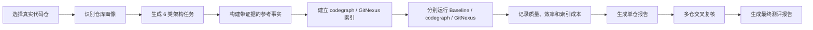

# codegraph 与 GitNexus 架构识别测评设计

> 这是一份面向分享和评审的测评设计说明。目标是让读者在几分钟内理解：我们为什么要这样测、具体怎么测，以及为什么这套结果相对真实可靠。

## 一分钟看懂

```text
真实问题：
陌生代码仓里，架构工具相对普通 agent 阅读源码到底有没有帮助？

对比方法：
同一个仓库、同一组架构问题，分别跑 Baseline、codegraph、GitNexus。

任务范围：
整体架构、入口流程、依赖关系、影响范围、新人阅读顺序、架构风险。

评价方式：
不只看答案是否正确，也看证据、响应时间、文件读取、搜索、tool calls、
token，以及首次索引和代码变化后的刷新成本。

可信性来源：
真实仓库、多任务、多人交叉执行、实验臂隔离、源码证据、多仓统一复核。
```

## 1. 我们想回答什么问题

这次测评不是比较工具宣传页上的功能数量，也不是验证工具能不能在一个 demo 项目里回答问题。

我们真正想回答的是：

```text
当研发人员不熟悉一个真实代码仓库，只能依靠内网 agent 和本地源码时，
codegraph 和 GitNexus 相对普通源码阅读，能否更准确、更高效地识别代码架构？
```

这里的“更好”需要可以量化，而不是只看答案读起来是否流畅。

我们关注：

- 架构结论是否准确
- 结论是否有源码证据
- agent 是否减少文件阅读和搜索
- 响应时间是否缩短
- tool calls、token 或代理 token 是否节约
- 工具建立索引和刷新索引的成本是否值得

## 2. 测评背景

本轮由 6 位执行人员对同一组 5 个真实代码仓进行交叉测评：

| 项目类型 | 仓库数量 |
| --- | ---: |
| Java | 2 |
| Vue | 3 |
| 合计 | 5 |

所有仓库源码都已经放在内网本地环境中。执行人员不需要提前熟悉项目，也不依赖公网文档。

这个场景接近实际工作：

- 新人接手陌生项目
- agent 首次进入一个代码仓
- 研发需要快速理解入口、模块、依赖和改动影响
- 内网环境不能依赖外部搜索

## 3. 核心设计：以 Baseline 为基准做三臂对比

每个仓库都执行三组实验：

| 实验臂 | 使用方式 | 想验证什么 |
| --- | --- | --- |
| Baseline | agent 只使用普通文件读取、目录浏览、文本搜索和 git 基础命令 | 不使用架构工具时，agent 自己能做到什么程度 |
| codegraph | agent 优先使用 codegraph，再用源码校验 | codegraph 相对 Baseline 提升了什么 |
| GitNexus | agent 优先使用 GitNexus，再用源码校验 | GitNexus 相对 Baseline 提升了什么 |

Baseline 是整个设计的基准。

如果没有 Baseline，我们只能知道工具“能回答”，但无法知道：

- 这些答案是不是 agent 原本就能找到
- 工具是否真的节省了探索步骤
- 工具是否只是增加了调用次数
- 工具索引成本能否换来实际收益

因此最终结论都以 Baseline 为参照：

```text
工具收益 = 工具实验臂结果 - Baseline 结果
```

## 4. 每个仓库测什么：6 类架构识别任务

架构识别不是单一能力。一个工具可能擅长找调用链，但不擅长解释模块职责；也可能能生成漂亮总结，但缺少可靠证据。

因此每个仓库都覆盖 6 类典型任务。

| 任务类型 | 要验证的能力 | 示例问题 |
| --- | --- | --- |
| 整体架构识别 | 识别模块、分层、入口和协作关系 | “请说明当前仓库的整体架构、主要模块、分层关系和关键入口。” |
| 入口流程识别 | 从入口追踪到核心运行流程 | “从应用启动入口开始，核心请求或页面初始化流程经过哪些模块？” |
| 依赖关系识别 | 识别模块之间的依赖方向 | “核心业务模块依赖哪些基础模块？是否存在反向依赖或跨层调用？” |
| 影响范围分析 | 判断改动核心文件会影响哪里 | “如果修改用户权限服务或请求封装模块，可能影响哪些入口和功能？” |
| 新人阅读顺序 | 形成有效的代码阅读路径 | “如果新人要理解这个项目，建议按什么顺序阅读哪些目录和文件？” |
| 架构风险识别 | 找出影响全局的关键模块和风险点 | “哪些模块最容易形成单点风险、耦合风险或大范围改动影响？” |

### 4.1 Java 项目示例

假设仓库是一个典型 Java 后端项目，任务可以落到：

```text
T01：说明 Application、Controller、Service、Repository/Mapper 的分层关系。
T02：从某个 REST API 入口追踪到核心 Service 和数据访问层。
T03：说明业务模块之间是否存在跨层依赖。
T04：修改某个 Service 接口会影响哪些 Controller、实现类和调用方。
T05：新人应该先读 pom.xml、启动类、Controller，还是 Service。
T06：指出配置、权限、公共服务或共享数据模型中的架构风险。
```

### 4.2 Vue 项目示例

假设仓库是一个 Vue 前端项目，任务可以落到：

```text
T01：说明 main.ts、router、views、components、store、api 的关系。
T02：从应用启动或某个页面路由追踪到组件、状态管理和接口请求。
T03：说明页面、公共组件、store、composable、api 模块之间的依赖方向。
T04：修改请求封装、权限路由或共享 store 会影响哪些页面。
T05：新人应该先读 vite.config、main.ts、router，还是核心 views。
T06：指出全局状态、路由权限、公共组件或请求层中的架构风险。
```

这些任务既覆盖“看全局”，也覆盖“追细节”，更接近真实研发对代码架构的使用方式。

## 5. 测评步骤

整套测评分为单仓执行和多仓复核两层。



### 5.1 识别仓库画像

每个仓库先记录：

- 仓库名
- 项目类型和主要语言
- 框架和构建工具
- 总文件数和源码文件数
- 总行数和源码行数
- 当前分支和 commit

仓库画像用于解释结果差异。一个 5 万行 Java 项目和一个 20 万行 Vue 项目，工具表现不能简单放在一起比较。

### 5.2 生成任务

agent 根据当前仓库结构生成 6 类架构任务。任务类型保持一致，但问题内容必须结合仓库实际文件、模块和入口。

这样既保证不同仓库之间可以比较，又避免用一套固定问题生搬硬套所有项目。

### 5.3 构建参考事实

在正式三臂实验前，先根据源码、配置、README、测试和构建文件，建立一组带证据的参考事实。

例如：

```yaml
claim: 用户请求由 UserController 进入，并调用 UserService。
evidence:
  - src/main/java/.../UserController.java
  - src/main/java/.../UserService.java
confidence: high
```

参考事实用于评分，但正式运行 Baseline、codegraph 和 GitNexus 时都不能读取它。

这样可以解决一个现实问题：执行人员不熟悉仓库，也没有一个提前准备好的标准答案。我们不要求人先成为项目专家，而是要求评分依据必须能回到源码证据。

### 5.4 分别运行三组实验

每个任务分别运行 Baseline、codegraph 和 GitNexus。

三组答案必须独立生成：

- Baseline 不能使用 codegraph 或 GitNexus
- codegraph 不能读取 GitNexus 结果
- GitNexus 不能读取 codegraph 结果
- 三组实验都不能读取参考事实或其他实验臂答案

如果发生实验臂污染，该结果不能进入主评分。

### 5.5 记录质量、效率和成本

每个任务不仅记录答案，还记录：

| 指标 | 含义 |
| --- | --- |
| 准确率 | 关键结论是否正确 |
| 证据质量 | 是否能用真实文件、符号或调用关系支撑 |
| 架构抽象 | 是否能从代码细节总结出合理的模块和职责 |
| 幻觉控制 | 是否虚构不存在的文件、模块或调用关系 |
| 响应时间 | 完成当前架构任务需要多久 |
| 文件读取数 | agent 为回答问题读取了多少文件 |
| 搜索次数 | agent 使用文本搜索的次数 |
| tool calls | agent 调用专用工具的次数 |
| token 或代理 token | 是否减少上下文读取和输出成本 |
| 索引成本 | 首次索引、无变更刷新、代码变化后刷新的时间 |

这里特别区分两种时间：

```text
回答时间：索引完成后，回答一个任务需要多久
端到端时间：索引时间 + 回答时间
```

工具可能回答很快，但首次索引很慢。只有把索引成本单独记录，才能判断它适合一次性问题，还是适合多轮持续使用。

### 5.6 生成单仓报告

每个仓库都会生成一份报告，展示：

- 仓库语言、文件数、代码行数和规模
- 三个实验臂的质量分和效率指标
- codegraph / GitNexus 相对 Baseline 的增益
- 索引和刷新成本
- 典型成功案例
- 典型失败案例

### 5.7 多仓交叉复核

所有单仓测评完成后，再统一做多仓复核：

- 检查每个仓库的结果是否完整
- 从原始评分数据重新计算汇总指标
- 抽样检查答案中的源码证据
- 识别失败样本、异常值和评分争议
- 按语言、项目类型和规模聚合结果

最终报告不是把单仓结论简单拼接，而是经过统一口径复核后的交叉测评结果。

## 6. 为什么这套设计相对真实

### 6.1 使用真实仓库，而不是 demo

真实仓库包含：

- 历史演化留下的复杂目录
- 框架约定和构建配置
- 公共模块和业务模块混合
- 动态依赖、间接调用和跨层关系

这些才是架构识别工具在实际研发中要面对的问题。

### 6.2 人不需要预先熟悉项目

测评模拟的是“第一次进入陌生仓库”的场景。执行人员不需要提前知道什么是真相，参考事实由 agent 基于源码证据构建，并在复核阶段抽样验证。

这比让熟悉项目的人主观评价“答案看起来对不对”更容易复制。

### 6.3 评价工具相对 Baseline 的增益

工具不是和“什么都不会”比较，而是和一个能读取源码、搜索文件、分析代码的普通 agent 比较。

只有工具明显提升准确率、减少探索成本，或者改善多轮使用效率，才算有真实价值。

### 6.4 同时看质量和效率

只看准确率会忽略成本，只看速度会鼓励草率答案。

本测评要求同时观察：

- 答案是否正确
- 证据是否可靠
- 是否减少文件读取和搜索
- 是否节约时间和 token
- 索引成本是否能被后续任务摊薄

### 6.5 多任务减少偶然性

单个问题可能刚好命中工具擅长的能力，也可能刚好被某个入口文件轻松回答。

6 类任务覆盖全局架构、调用流程、依赖、影响范围、新人理解和风险识别，使结论不依赖单题表现。

### 6.6 多人交叉执行降低单次 agent 偏差

同一组仓库由多位执行人员交叉测评，可以观察：

- 结论是否稳定
- 工具是否容易被正确使用
- 某些收益是否只出现在个别运行中
- 易用性问题是否会影响最终效果

这对于 AI 工具尤其重要，因为工具价值不仅取决于底层能力，也取决于 agent 是否容易正确调用它。

## 7. 为什么这套设计相对可靠

| 可靠性原则 | 设计措施 |
| --- | --- |
| 有可比较的基准 | 使用 Baseline 作为统一参照 |
| 减少单题偶然性 | 每仓覆盖 6 类架构任务 |
| 减少单仓偏差 | 同时测 Java 和 Vue 真实项目 |
| 减少单次运行偏差 | 6 位执行人员交叉测评 |
| 结论可追溯 | 答案、指标、工具日志和源码证据都保留 |
| 防止实验污染 | 三个实验臂独立运行，禁止互相读取结果 |
| 评分有依据 | 使用带证据的参考事实，不只凭主观印象 |
| 汇总可复核 | 多仓报告从原始数据重算，并抽样核验证据 |
| 成本不被隐藏 | 单独记录索引、刷新和端到端时间 |

## 8. 如何阅读最终报告

最终报告中的结论建议按下面顺序阅读：

1. 先看样本范围：语言、仓库规模、有效样本数。
2. 再看质量增益：工具是否比 Baseline 更准确。
3. 再看效率增益：时间、文件读取、搜索、tool calls、token 是否改善。
4. 再看索引成本：首次使用和代码变化后的维护成本。
5. 最后看典型案例：工具在哪些任务上真正有帮助，在哪些任务上容易失败。

不要只看一个平均分。一个工具可能总体平均不错，但只在 Java 上有效；也可能回答阶段很快，但首次索引成本很高。

## 9. 设计边界

这套测评设计相对真实可靠，但仍有边界：

- 当前样本只有 5 个仓库，不能代表所有 Java 和 Vue 项目。
- 不同仓库的业务复杂度、框架版本和代码质量不同。
- 参考事实由 agent 构建，仍可能存在遗漏，需要抽样复核。
- 不同模型、不同 agent 配置可能产生不同结果。
- 本轮结论适用于“架构识别”场景，不直接等同于代码生成、缺陷修复或代码审查能力。

因此最终结论应理解为：

```text
在当前内网 agent、当前真实仓库样本和当前架构识别任务下，
codegraph 与 GitNexus 相对 Baseline 的实操表现。
```

## 10. 相关文档

- [codegraph-gitnexus单仓Agent执行手册.md](./codegraph-gitnexus单仓Agent执行手册.md)
- [codegraph-gitnexus多仓结果复核与最终报告手册.md](./codegraph-gitnexus多仓结果复核与最终报告手册.md)
